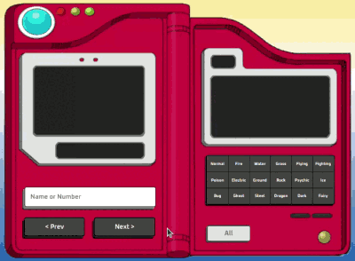

# Pokédex

Este projeto consiste em uma Pokédex online, que permite ao usuário pesquisar e visualizar informações sobre diferentes pokémons, como nome, número, tipo, habilidades, categoria, altura e peso. Além disso, a Pokédex conta com botões para navegar entre os diferentes pokémons, bem como botões para filtrar os resultados por tipo.

## Tecnologias Utilizadas

HTML
CSS
JavaScript
Como Executar o Projeto
Para executar o projeto, basta clonar este repositório em seu computador e abrir o arquivo index.html em um navegador de sua preferência.

# Como Executar o Projeto

Para executar o projeto, basta clonar este repositório em seu computador e abrir o arquivo index.html em um navegador de sua preferência.

